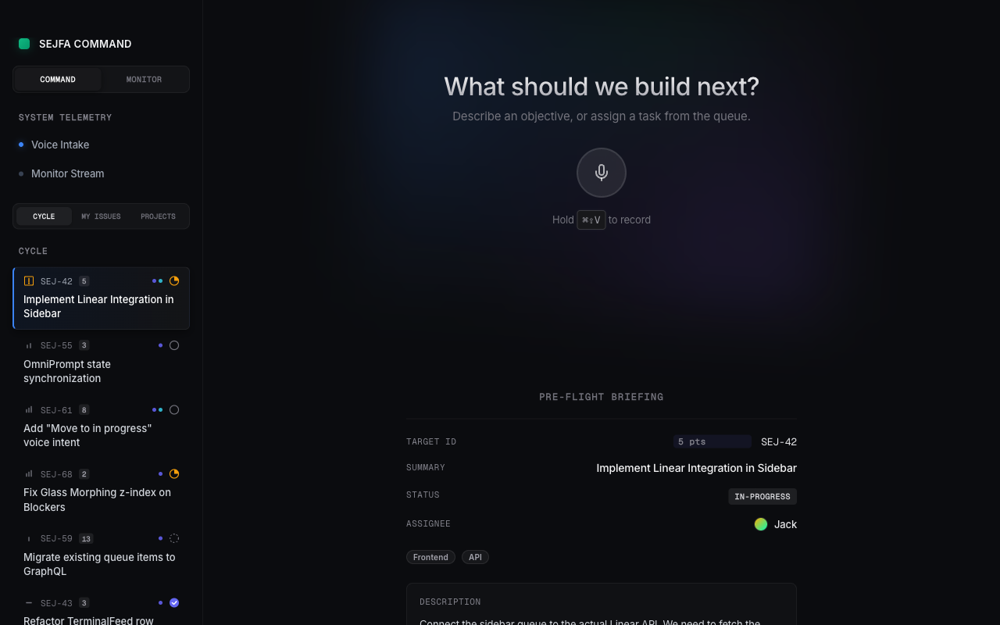
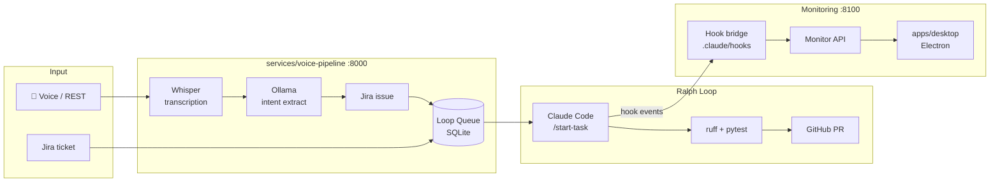

# SEJFA — Agentic Software-Delivery Loop

[](https://github.com/itsimonfredlingjack/agentic-devops-pipeline-v2/actions/workflows/ci.yml)
[](https://github.com/itsimonfredlingjack/agentic-devops-pipeline-v2/actions/workflows/desktop.yml)
[](LICENSE)
[](pyproject.toml)

> **Portfolio / learning project.** Built to explore how AI agents can close the full DevOps loop — from task intake to verified, reviewed code — with minimal human intervention.

A task arrives (via Jira or voice). The **Ralph Loop** picks it up, plans, implements, runs verification gates, and hands off a pull request. Voice and monitoring are layers around that loop — not the loop itself.

```
voice / Jira issue
  → queue
  → Ralph Loop  (Claude Code runs autonomously)
  → ruff + pytest gates
  → GitHub PR + review
  → next task
```



---

## Monorepo Layout

```
sejfa/
├── apps/
│   ├── desktop/              Electron + React 18 control surface (Command Desk)
│   └── chatgpt-companion/   React widget for the ChatGPT companion
│
├── services/
│   ├── voice-pipeline/       FastAPI — audio → Whisper → Ollama → Jira ticket
│   ├── monitor-api/          FastAPI — hook events, session observability
│   └── loop-engine/          Loop runner: polls queue, dispatches to Claude Code
│
├── packages/
│   ├── data-client/          TypeScript API client (voice backend)
│   ├── shared-types/         Shared TypeScript interfaces
│   └── ui-system/            Shared React component library
│
├── src/
│   ├── sejfa/                Shared Python utilities (Jira, monitor, security)
│   └── chatgpt_companion/    ChatGPT MCP server (read-only workspace inspector)
│
├── docs/
│   ├── ARCHITECTURE.md
│   ├── RALHP-LOOP-GUIDELINES.md
│   └── assets/               Screenshots and design assets
│
├── scripts/                  CI, deploy, Jira, Jules, and loop helpers
└── tests/                    pytest suites mirroring source structure
```

---

## Architecture



---

## Quick Start

### Prerequisites

- Python 3.11+
- Node.js 20+
- Ollama (local or remote via Tailscale)

### 1. Clone and install

```bash
git clone https://github.com/itsimonfredlingjack/agentic-devops-pipeline-v2.git
cd agentic-devops-pipeline-v2

# Python deps
pip install -r requirements.txt

# Node deps (workspaces: packages/* + apps/*)
npm install

# Copy and fill in credentials
cp .env.example .env
```

### 2. Run the full local stack

```bash
./scripts/start-sejfa-local.sh start    # voice :8000  monitor :8110  companion :8788
./scripts/start-sejfa-local.sh status
./scripts/start-sejfa-local.sh stop
```

Or start services individually:

| Service | Command | Port |
|---|---|---|
| Voice pipeline | `PYTHONPATH=services/voice-pipeline/src uvicorn voice_pipeline.main:app --reload` | 8000 |
| Monitor API | `PYTHONPATH=services/monitor-api/src uvicorn monitor.api:app` | 8100 |
| Desktop app | `npm --workspace @sejfa/desktop run electron:dev` | 5173 |
| ChatGPT companion | `./scripts/start-chatgpt-companion.sh start` | 8787 |

### 3. Run verification

```bash
bash scripts/ci_check.sh        # ruff lint + pytest with coverage
pytest tests/ -xvs              # full test suite
```

---

## API Surface

### Voice pipeline (`services/voice-pipeline` · `:8000`)

| Endpoint | Method | Purpose |
|---|---|---|
| `/health` | GET | Health check |
| `/api/transcribe` | POST | Audio → text |
| `/api/extract` | POST | Text → Jira intent |
| `/api/pipeline/run` | POST | Full voice intake pipeline |
| `/api/pipeline/clarify` | POST | Ambiguity clarification |
| `/api/loop/queue` | GET | Inspect pending work |
| `/api/loop/started` | POST | Mark work as started |
| `/api/loop/completed` | POST | Mark work as completed |
| `/ws/status` | WS | Live pipeline status |

### Monitor API (`services/monitor-api` · `:8100`)

| Endpoint | Method | Purpose |
|---|---|---|
| `/events` | POST | Receive Claude hook events |
| `/events` | GET | Query stored events |
| `/sessions` | GET | List sessions |
| `/sessions/{id}` | GET | Inspect one session |
| `/status` | GET | Current monitor status |
| `/reset` | POST | Reset in-memory analyzers |

---

## Tech Stack

| Layer | Stack |
|---|---|
| Execution | Claude Code (Ralph Loop), bash |
| Voice / intent | faster-whisper, Ollama (Qwen 2.5) |
| Backend | Python 3.11, FastAPI, Uvicorn, Pydantic, aiosqlite |
| Desktop | Electron 35, React 18, TypeScript, Vite, Zustand |
| Packages | npm workspaces, TypeScript |
| CI | GitHub Actions (Python lint + test, desktop build) |
| Deployment | Docker, Caddy, Hetzner |

---

## Infrastructure

| Node | Role |
|---|---|
| Mac | Orchestration: voice backend, Ralph Loop, desktop app |
| ai-server2 | Inference: Whisper + Ollama (RTX 2060, Tailscale) |
| Hetzner | Demo / production deployment |

---

## Docs

| Document | Purpose |
|---|---|
| [CLAUDE.md](CLAUDE.md) | Agent instructions for Claude Code (Ralph Loop) |
| [AGENTS.md](AGENTS.md) | Repo guide for all AI agents |
| [docs/ARCHITECTURE.md](docs/ARCHITECTURE.md) | Full architecture deep-dive |
| [docs/RALHP-LOOP-GUIDELINES.md](docs/RALHP-LOOP-GUIDELINES.md) | Ralph Loop execution guidelines |
| [docs/REMOTE_DEV.md](docs/REMOTE_DEV.md) | Remote inference (ai-server2) setup |
| [docs/CHATGPT_COMPANION.md](docs/CHATGPT_COMPANION.md) | ChatGPT companion setup and tool surface |

---

## Status

This is a learning and portfolio project, not a production product. What works:

- ✅ Voice pipeline (transcription → intent → Jira ticket → queue)
- ✅ Ralph Loop execution via Claude Code `/start-task`
- ✅ Monitor API with hook bridge
- ✅ Electron desktop app (Command Desk)
- ✅ ChatGPT companion (read-only MCP)
- ✅ Python CI (ruff + pytest, coverage ≥ 65 %)
- ⚠️ Jira integration requires your own credentials
- ⚠️ Voice pipeline requires Ollama (local or remote)
- ❌ No root-level end-to-end CI pipeline (Python and desktop CI are separate)

---

## License

[MIT](LICENSE)
