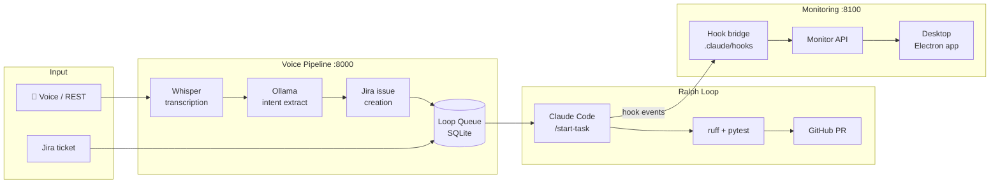

# SEJFA — Agentic Software-Delivery Loop

**Portfolio / learning project.** SEJFA är ett autonomt mjukvaruleveransflöde byggt för att utforska hur AI-agenter kan stänga hela DevOps-slingan — från uppgift till verifierat kodresultat — med minimalt manuellt ingripande.

Kärnan: en inkommande uppgift (via Jira eller röst) blir ett autonomt exekveringscykel (Ralph Loop) som planerar, implementerar, testar och skickar för granskning. Röst är ett intakslager. Monitoring är ett observerbarhetsflöde runt loopen.

```text
röst / Jira-ärende
  → uppgiftskö
  → Ralph Loop (Claude Code kör autonomt)
  → verifikationsgrindarna (ruff + pytest)
  → granskningsfeedback
  → leverans / nytt ärende
```

**Vad som faktiskt körs:** Python-backend (FastAPI), monitor-API, Electron-skrivbordsapp (Command Desk), ChatGPT-companion.  
**Vad som är halvfärdigt / kräver egna credentials:** Jira-integrationen, röstpipelinen mot en extern Ollama-nod, desktop-appen mot en live backend.  
**Vad som inte finns:** samlad root-level CI-pipeline (`.github/workflows/` innehåller workflows för desktop och Python separat, men ingen end-to-end CI-gate).


## Architecture Overview



## What SEJFA Is

SEJFA is the loop-first system built around these ideas:

- Jira-centered task intake
- autonomous execution through the Ralph Loop
- verification before completion
- review feedback that can create follow-up work
- hard boundaries between instructions, data, and monitoring

The repository currently contains:

- the loop-facing backend split across `services/` and `src/`
- a voice pipeline backend in `services/voice-pipeline/src/voice_pipeline/`
- a monitor API in `services/monitor-api/src/monitor/`
- an Electron desktop control surface in `desktop/`
- shared frontend packages in `packages/`
- helper scripts for Jira, Jules, queueing, and loop operations in `scripts/`

The repository does not currently contain a root GitHub Actions workflow. Old documents that describe those workflows as already present are kept as archive material only.

## System Roles

### Core

The core is the autonomous software-delivery loop:

`task -> branch/context -> implement -> test/lint -> review -> close or continue`

This is what SEJFA fundamentally is.

### Voice Start Layer

The voice layer is a subsystem that helps start or feed the loop.

In the current repo it includes:

- a FastAPI backend in `services/voice-pipeline/src/voice_pipeline/`
- Whisper transcription and Ollama intent extraction
- Jira ticket creation and loop queueing

Voice is important, but it is not the primary identity of the project.

### Monitoring Companion

Monitoring is a companion observability and control surface around the loop.

In the current repo it includes:

- the monitor API in `services/monitor-api/src/monitor/`
- Claude hook event forwarding in `.claude/hooks/`

### Desktop App (Command Desk)

An Electron + React 18 + Vite desktop companion in `desktop/`. Provides a control surface with monitor dashboard, command palette, mission dossier, and terminal feed. Connects to the voice pipeline and monitor API over localhost.

## Machine Topology

### Mac

The Mac is the orchestration machine.

- runs the FastAPI backend on `:8000`
- runs the Electron desktop app (`desktop/`)
- runs Claude Code and the Ralph Loop
- can run the monitor API on `:8100`

### ai-server2

`ai-server2` is the remote inference machine.

- runs Whisper and Ollama workloads
- is used as the GPU path for transcription and intent extraction
- should not be treated as the home of the whole SEJFA system

### Hetzner

Hetzner is a demo/deployment host, not the loop core.

## Docs Map

### Canonical / current

- [README.md](README.md)
- [CLAUDE.md](CLAUDE.md)
- [docs/ARCHITECTURE.md](docs/ARCHITECTURE.md)
- [docs/RALHP-LOOP-GUIDELINES.md](docs/RALHP-LOOP-GUIDELINES.md)
- [docs/REMOTE_DEV.md](docs/REMOTE_DEV.md)
- [docs/CHATGPT_COMPANION.md](docs/CHATGPT_COMPANION.md)

### Service surfaces

- `services/voice-pipeline/` is the voice start backend
- `services/monitor-api/` is the observability and session API
- `services/loop-engine/` is the execution-layer boundary, not a UI
- `desktop/` is the Electron control surface

### Archive / speculative / companion references

- [docs/JULES_INTEGRATION.md](docs/JULES_INTEGRATION.md)
- [docs/jules-playbook.md](docs/jules-playbook.md)
- [docs/plans/2026-03-14-sejfa-desktop-app.md](docs/plans/2026-03-14-sejfa-desktop-app.md)

## What Exists In The Repo

```text
.
├── .claude/hooks/          # Hook-to-monitor bridge
├── .claude/commands/       # Ralph Loop /start-task and /finish-task commands
├── .github/workflows/      # Python CI + desktop build workflows
├── desktop/                # Electron + React control surface (Command Desk)
├── docs/                   # Canonical docs plus archive references
├── packages/               # Shared UI, contracts, and frontend data clients
├── services/
│   ├── loop-engine/        # Execution-layer boundary and loop runner home
│   ├── monitor-api/        # Monitor API source
│   └── voice-pipeline/     # Voice pipeline source
├── scripts/                # Queue, Jira, Jules, systemd, loop helpers
├── src/sejfa/              # Shared utilities
└── tests/                  # Python test suites
```

## Run The Current Repo

### Python backend

```bash
pip install -r requirements.txt
PYTHONPATH=services/voice-pipeline/src uvicorn voice_pipeline.main:app --host 0.0.0.0 --port 8000 --reload
```

### Monitor API

```bash
PYTHONPATH=services/monitor-api/src uvicorn monitor.api:app --host 0.0.0.0 --port 8100
```

### Local dev stack

To run the SEJFA local stack without colliding with other local MCP or monitor
projects, use the orchestrator script:

```bash
./scripts/start-sejfa-local.sh start
./scripts/start-sejfa-local.sh status
./scripts/start-sejfa-local.sh stop
```

Default local ports:

- voice pipeline: `8000`
- monitor API: `8110`
- ChatGPT companion: `8788`

You can override any of them with environment variables such as
`SEJFA_MONITOR_PORT=8120` or `SEJFA_CHATGPT_COMPANION_PORT=8790`.

### Desktop app

```bash
npm --workspace desktop run electron:dev
```

### Tests

```bash
pytest tests/ -xvs
```

## Current API Surface

### Voice start layer

| Endpoint | Method | Purpose |
|----------|--------|---------|
| `/health` | `GET` | Health check |
| `/api/transcribe` | `POST` | Audio to text |
| `/api/extract` | `POST` | Text to Jira intent |
| `/api/pipeline/run` | `POST` | Run the voice intake pipeline |
| `/api/pipeline/clarify` | `POST` | Continue ambiguity clarification |
| `/api/loop/queue` | `GET` | Inspect pending loop work |
| `/api/loop/started` | `POST` | Mark queued work as started |
| `/api/loop/completed` | `POST` | Mark queued work as completed |
| `/ws/status` | `WS` | Pipeline status updates |

### Monitor companion

| Endpoint | Method | Purpose |
|----------|--------|---------|
| `/events` | `POST` | Receive hook events |
| `/events` | `GET` | Query stored events |
| `/sessions` | `GET` | List monitor sessions |
| `/sessions/{session_id}` | `GET` | Inspect one session |
| `/status` | `GET` | Current monitor status |
| `/reset` | `POST` | Reset in-memory analyzers |

## Repository Truths

- SEJFA is the loop-first system.
- Voice starts or feeds the loop.
- `ai-server2` is the inference node, not the whole platform.
- Monitoring is a companion surface, not the root product identity.
- Archive docs are retained for history and planning, not as the source of truth.
